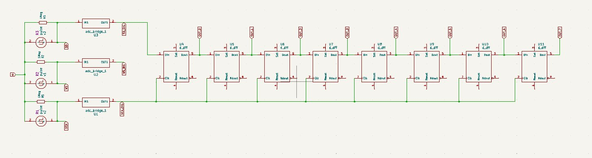
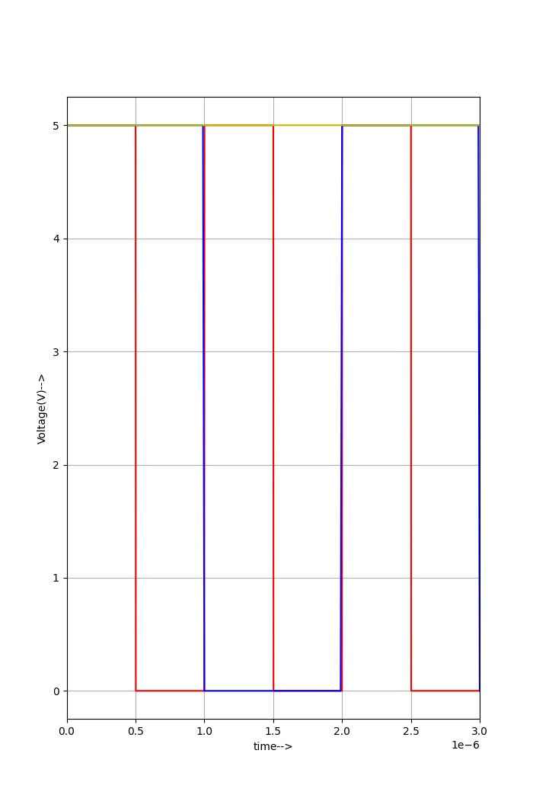
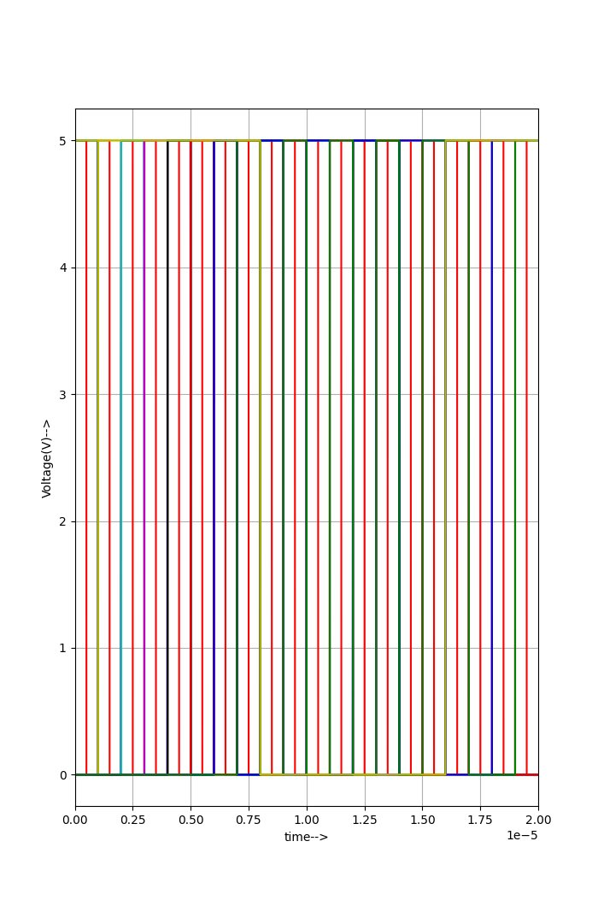
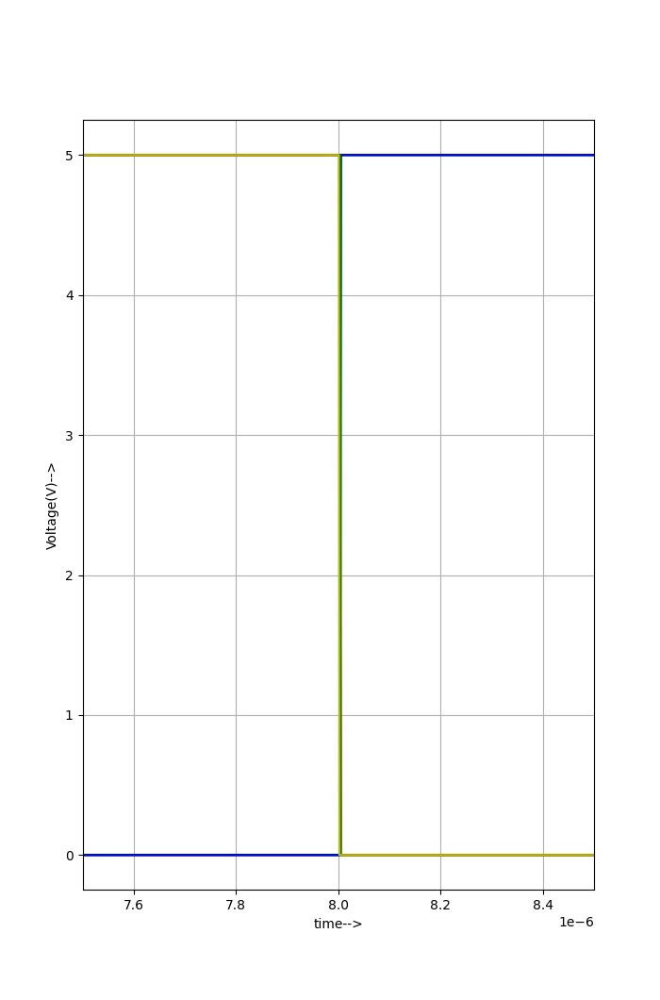
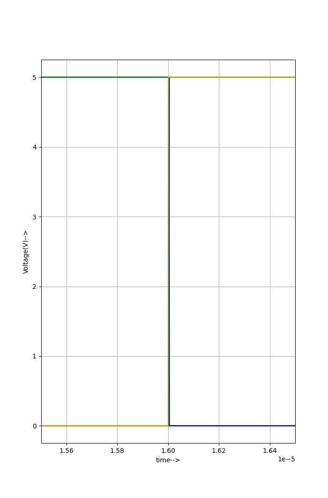
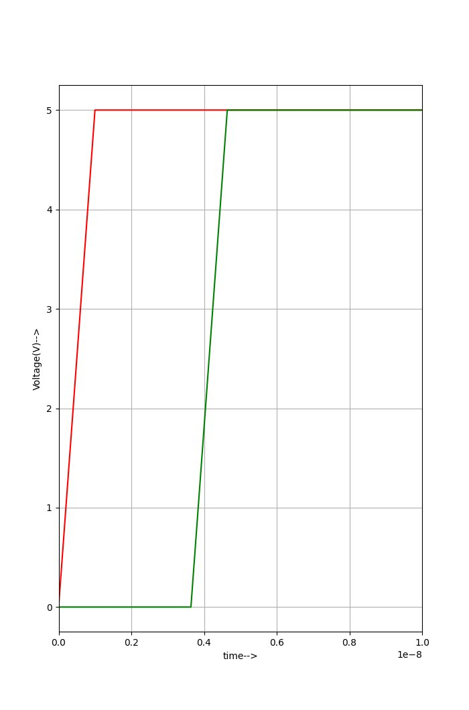

# Circuit-Level Modelling and Verification of I2S Protocol with Gate-Level SIPO Receiver
 
Published on FOSSEE eSim Circuit Simulation Repository, IIT Bombay  
[View on FOSSEE](https://esim.fossee.in/circuit-simulation-project/esim-circuit-simulation-run/766)  
**Contributor:** Juned Pinjari | Government College of Engineering, Nagpur  
**Tools:** eSim 2.5 · Ngspice · KiCad 8.0
 
---
 
## Overview
 
This project implements and verifies the I2S (Inter-IC Sound) serial audio protocol at the circuit level using a mixed-signal SPICE simulation. The I2S protocol (developed by Philips Semiconductors) is the standard interface used in audio ICs, DACs, ADCs, and DSPs across the semiconductor industry.
 
The simulation models an 8-bit SIPO (Serial-In Parallel-Out) shift register receiver:
- Built from XSPICE `d_dff` primitives clocked by SCK
- PWL-based transmitter generating Left and Right channel audio frames
- Philips I2S specification compliance for WS-framing and MSB-first bit ordering
- Channel separation verified by temporal sampling of SIPO outputs at WS frame boundaries
---
 
## Verification Results
 
| Parameter | Requirement | Observed | Status |
|---|---|---|---|
| SCK Frequency | 1 MHz | 1 MHz | Pass |
| WS Frequency | 62.5 kHz | 62.5 kHz | Pass |
| Left Channel Payload | `10101010` | `10101010` | Pass |
| Right Channel Payload | `11001100` | `11001100` | Pass |
| XSPICE Model Delay (d_dff) | < 10 ns | 3.65 ns | Pass |
 
> **Note on delay measurement:** The 3.65 ns figure is the sum of `clk_delay`, `t_rise`, and `t_fall` parameters defined in the XSPICE `.model` card for the `d_dff` primitive. It reflects the behavioral macro-model timing, not a physical silicon gate delay. A transistor-level implementation using a foundry PDK (e.g. Sky130) would be required to measure a physically meaningful propagation delay.
 
---
 
## Circuit Architecture
 
### Schematic — Logical Architecture (KiCad 8.0)
 

 
Three `adc_bridge_1` converters translate SCK, WS, and SD into the digital domain. Eight cascaded `d_dff` primitives form the SIPO shift register (U4–U11). Eight `dac_bridge_1` converters translate digital outputs back to analog for Ngspice plotting.
 
### Signal Roles
 
| Signal | Description |
|---|---|
| SCK | Master Serial Clock — 1 MHz PULSE, 5 V, 50% duty cycle |
| WS | Word Select (LR Clock) — 62.5 kHz PULSE, WS=0: Left Ch, WS=1: Right Ch |
| SD | Serial Data — PWL source encoding `10101010` (Left) and `11001100` (Right) |
| SCK_DIG / WS_DIG / SD_DIG | Digital-domain equivalents via `adc_bridge_1` converters |
| OUT_0 – OUT_7 | Parallel SIPO outputs (MSB = OUT_7, LSB = OUT_0) |
| VOUT_0 – VOUT_7 | Analog-domain equivalents via `dac_bridge_1` for Ngspice plotting |
 
### Design Decisions
 
**Why a hybrid PWL + XSPICE testbench?**  
Hardware latching using WS-derived gated clocks was attempted but caused XSPICE convergence failures in Ngspice's transient solver due to sharp `adc_bridge` transitions triggering step-size rejections. As a workaround, channel separation is verified by temporal sampling of SIPO outputs at WS frame boundaries (t=8.0 µs for Left, t=16.0 µs for Right). This is an open-loop verification approach — the shift register does not autonomously demultiplex the I2S stream via a WS-triggered latch. A proper hardware fix would require relaxing `t_rise`/`t_fall` on the ADC bridges and implementing the parallel latch in XSPICE.
 
**Why manually authored `.cir` instead of KiCad netlist export?**  
KiCad 8.0 strips XSPICE symbols (`adc_bridge_1`, `d_dff`) during netlist export due to node-validation rule changes. The KiCad schematic serves as the logical architecture diagram only. The simulation testbench `I2S_Protocol_Simulation_tb.cir` was hand-authored with XSPICE instances injected directly and must be used as-is — do not regenerate the netlist from the schematic.
 
---
 
## Waveforms
 
### Input Stimulus and I2S Timing Alignment
WS transitions exactly one SCK cycle before the MSB — per Philips I2S specification.
 

 
### Full 16-bit Stereo Frame (0–20 µs)
Left Channel (WS=0, t=0–8 µs) and Right Channel (WS=1, t=8–16 µs).
 

 
### Left Channel Data Extraction (at t = 8.0 µs)
SIPO parallel outputs stable at `10101010` at the WS=0 window close.
 

 
### Right Channel Data Extraction (at t = 16.0 µs)
SIPO parallel outputs stable at `11001100` at the WS=1 window close.
 

 
### XSPICE Model Delay: 3.65 ns
Measured from SCK rising edge to VOUT_0 output transition within the XSPICE simulation domain.
 

 
---
 
## Repository Structure
 
```
i2s-protocol-verification/
├── simulation/
│   ├── I2S_Protocol_Simulation_tb.cir     <- Hand-authored Ngspice testbench (use this)
│   ├── I2S_Protocol_Simulation.cir        <- eSim-generated stub (for reference only)
│   ├── I2S_Protocol_Simulation.kicad_sch  <- Logical architecture schematic (KiCad 8.0)
│   ├── I2S_Protocol_Simulation.net        <- KiCad netlist export (partial, see note below)
│   └── I2S_Protocol_Simulation.proj       <- eSim project file
├── results/
│   ├── plot_data_v.txt                    <- Voltage data from Ngspice (print allv)
│   ├── plot_data_i.txt                    <- Current data from Ngspice (print alli)
│   └── waveforms/                         <- eSim Python plots from Ngspice simulation
│       ├── fig2_input_stimulus.png
│       ├── fig3_full_frame.png
│       ├── fig4_left_channel.png
│       ├── fig5_right_channel.png
│       └── fig6_propagation_delay.png
└── docs/
    ├── schematic_logical_architecture.png
    └── I2S_Abstract_Juned_Pinjari.pdf
```
 
**Note on `.net` file:** The KiCad-exported netlist only contains R and PULSE source components. XSPICE primitives (`d_dff`, `adc_bridge_1`, `dac_bridge_1`) are stripped by KiCad 8.0's node-validation rules. The complete simulation netlist is in `I2S_Protocol_Simulation_tb.cir`.
 
---
 
## How to Run
 
**Requirements:** eSim 2.5 with Ngspice backend — [Download eSim](https://esim.fossee.in/downloads)
 
1. Extract the project and open `simulation/I2S_Protocol_Simulation.proj` via eSim GUI (`File -> Open Project`)
2. **Do not run the KiCad to Ngspice converter.** The hand-authored `I2S_Protocol_Simulation_tb.cir` must be used directly — running the converter will overwrite it with a stripped netlist missing all XSPICE components
3. Click `Simulation` in the eSim GUI and select `I2S_Protocol_Simulation_tb.cir` as the netlist
4. Results are written to `plot_data_v.txt` and `plot_data_i.txt` via the `.control` block — open `I2S_Protocol_Simulation_tb.cir` in a text editor to inspect the full control block before running
---
 
## References
 
1. NXP Semiconductors. UM11732 — I2S Bus Specification, Rev. 3.0, February 2022. https://www.nxp.com/docs/en/user-manual/UM11732.pdf
2. FOSSEE Team, IIT Bombay. eSim User Manual v2.5. https://esim.fossee.in
3. Wikipedia. Inter-IC Sound (I2S). https://en.wikipedia.org/wiki/I2S
---
 
## About
 
Developed as part of the [FOSSEE Circuit Simulation Project](https://esim.fossee.in/circuit-simulation-project), IIT Bombay. Demonstrates mixed-signal protocol verification using open-source EDA tools.
 
**Skills demonstrated:** SPICE netlist authoring · XSPICE mixed-signal simulation · Digital protocol verification · eSim/KiCad toolchain · Ngspice waveform analysis
 
---
 
## License
 
Copyright transferred to the FOSSEE Project, IIT Bombay.  
Released under [Creative Commons Attribution-ShareAlike 4.0 International (CC BY-SA 4.0)](https://creativecommons.org/licenses/by-sa/4.0/).  
Original contributor: [Juned Pinjari](https://github.com/juned-pinjari/), Government College of Engineering, Nagpur.
 
